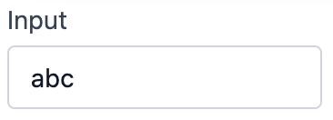
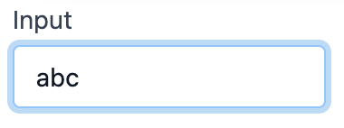
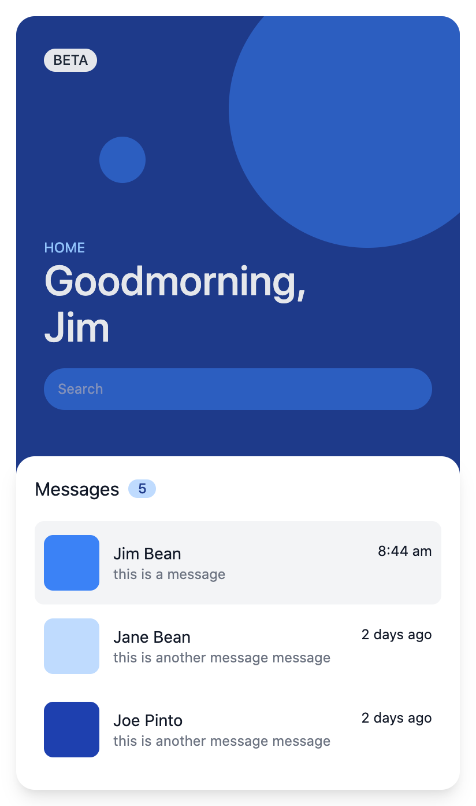

<svg width="857px" height="460px" viewBox="0 0 857 460" version="1.1" xmlns="http://www.w3.org/2000/svg" xmlns:xlink="http://www.w3.org/1999/xlink">
    <g id="Page-1" stroke="none" stroke-width="1" fill="none" fill-rule="evenodd">
        <g id="Group-2">
            <rect id="Rectangle" stroke="#979797" fill="#F0C2F1" x="0.5" y="0.5" width="856" height="459" rx="20"></rect>
            <rect id="Rectangle" stroke="#6B2A4D" fill="#EFEFEF" x="61.5" y="134.5" width="730" height="270" rx="9"></rect>
            <circle id="Oval" stroke="#979797" fill="#D8D8D8" cx="83.5" cy="153.5" r="8"></circle>
            <circle id="Oval" stroke="#6B2A4D" cx="110.5" cy="153.5" r="8"></circle>
            <circle id="Oval" stroke="#6B2A4D" cx="83.5" cy="153.5" r="8"></circle>
            <circle id="Oval" stroke="#6B2A4D" cx="137.5" cy="153.5" r="8"></circle>
            <g id="angular-seeklogo.com" transform="translate(111.000000, 245.000000)" fill-rule="nonzero">
                <g id="Group" transform="translate(74.000000, 15.000000)" fill="#B52E31">
                    <polygon id="Path" points="0.292561983 35.4082192 0.292561983 4.33972603 4.24214876 4.33972603 23.014876 29.3424658 23.014876 4.33972603 26.7694215 4.33972603 26.7694215 35.4082192 22.8198347 35.4082192 4.04710744 10.1589041 4.04710744 35.4082192"></polygon>
                    <path d="M57.3421488,34.1753425 C54.8553719,35.1123288 52.1735537,35.6054795 49.3454545,35.6054795 C38.2280992,35.6054795 32.6694215,30.230137 32.6694215,19.430137 C32.6694215,9.22191781 38.0330579,4.09315068 48.7603306,4.09315068 C51.8322314,4.09315068 54.7090909,4.5369863 57.3421488,5.37534247 L57.3421488,8.82739726 C54.7090909,7.79178082 51.9785124,7.29863014 49.1991736,7.29863014 C40.8123967,7.29863014 36.6190083,11.3424658 36.6190083,19.3315068 C36.6190083,27.9616438 40.7636364,32.2520548 49.0041322,32.2520548 C50.3206612,32.2520548 51.7834711,32.0547945 53.392562,31.709589 L53.392562,21.3041096 L57.3421488,21.3041096 L57.3421488,34.1753425 L57.3421488,34.1753425 Z" id="Path"></path>
                    <path d="M63.6809917,23.4246575 L63.6809917,4.33972603 L67.6305785,4.33972603 L67.6305785,23.4246575 C67.6305785,29.3917808 70.5561983,32.4 76.4561983,32.4 C82.307438,32.4 85.2818182,29.3917808 85.2818182,23.4246575 L85.2818182,4.33972603 L89.231405,4.33972603 L89.231405,23.4246575 C89.231405,31.5616438 84.9892562,35.6547945 76.4561983,35.6547945 C67.9231405,35.6547945 63.6809917,31.5616438 63.6809917,23.4246575 L63.6809917,23.4246575 L63.6809917,23.4246575 Z" id="Path"></path>
                    <polygon id="Path" points="100.25124 4.33972603 100.25124 32.1534247 116.342149 32.1534247 116.342149 35.4082192 96.3016529 35.4082192 96.3016529 4.33972603"></polygon>
                    <polygon id="Path" points="122.047107 35.4082192 117.902479 35.4082192 133.164463 0.246575342 148.426446 35.4082192 144.038017 35.4082192 140.08843 25.6438356 129.946281 25.6438356 131.019008 22.3890411 138.771901 22.3890411 133.018182 8.33424658"></polygon>
                    <path d="M152.668595,35.4082192 L152.668595,4.33972603 L165.785124,4.33972603 C171.636364,4.33972603 174.561983,6.80547945 174.561983,11.7863014 C174.561983,15.830137 171.685124,18.8383562 165.980165,20.7616438 L176.512397,35.4082192 L171.295041,35.4082192 L161.542975,21.4520548 L161.542975,18.8383562 C167.394215,17.9013699 170.368595,15.6328767 170.368595,11.9835616 C170.368595,9.12328767 168.759504,7.69315068 165.492562,7.69315068 L156.715702,7.69315068 L156.715702,35.4082192 L152.668595,35.4082192 L152.668595,35.4082192 Z" id="Path"></path>
                </g>
                <g id="Group">
                    <polygon id="Path" fill="#E23237" points="0 11.2517986 31.5114504 0 63.8534351 11.0561151 58.6259542 52.7856115 31.5114504 67.8043165 4.83664122 52.981295"></polygon>
                    <polygon id="Path" fill="#B52E31" points="63.8534351 11.0561151 31.5114504 0 31.5114504 67.8043165 58.6259542 52.7856115"></polygon>
                    <path d="M31.5603053,7.92517986 L31.5603053,7.92517986 L11.9206107,51.6604317 L19.248855,51.5136691 L23.2061069,41.6316547 L31.5603053,41.6316547 L40.7450382,41.6316547 L45.0442748,51.6115108 L52.0305344,51.7582734 L31.5603053,7.92517986 L31.5603053,7.92517986 Z M31.6091603,21.9654676 L38.2534351,35.8589928 L31.9022901,35.8589928 L31.5603053,35.8589928 L25.7954198,35.8589928 L31.6091603,21.9654676 L31.6091603,21.9654676 Z" id="Shape" fill="#FFFFFF"></path>
                </g>
            </g>
            <g id="tailwind" transform="translate(429.000000, 260.000000)">
                <path d="M32.000627,0 C23.4665413,0 18.1341485,4.22249967 15.9996865,12.667499 C19.2001254,8.44499934 22.9335528,6.8618741 27.1999686,7.91687475 C29.6341583,8.51866211 31.3748359,10.2665922 33.2998648,12.2018005 C36.4375992,15.3530687 40.0694453,19 48.0003135,19 C56.5331452,19 61.8667921,14.7775003 64,6.33374951 C60.8008152,10.5562492 57.0673878,12.1393744 52.8009719,11.0831252 C50.3655282,10.4813379 48.6248506,8.73340781 46.6998217,6.79944802 C43.5620873,3.64568274 39.9314953,0 32.000627,0 Z M15.9996865,19 C7.46685478,19 2.13320792,23.2224997 0,31.667499 C3.20043893,27.4449993 6.93386632,25.8618741 11.1990281,26.9168748 C13.6344718,27.5186621 15.3751494,29.2665922 17.3001783,31.2018005 C20.4379127,34.3530687 24.0685047,38 32.000627,38 C40.5334587,38 45.8671056,33.7787489 48.0003135,25.3337495 C44.7998746,29.5562492 41.0664472,31.1393744 36.8000314,30.0843738 C34.3658417,29.4813379 32.6251641,27.7334078 30.7001352,25.799448 C27.5624008,22.6481798 23.9305547,19 15.9996865,19 Z" id="Shape" fill="#06B6D4"></path>
                <path d="M95.6359152,16.2855796 L90.0348727,16.2855796 L90.0348727,27.2668426 C90.0348727,30.1957776 91.9316552,30.1496324 95.6359152,29.9663336 L95.6359152,34.4052403 C88.1368325,35.3204524 85.1558151,33.215721 85.1558151,27.2668426 L85.1558151,16.2855796 L81,16.2855796 L81,11.5262205 L85.1558151,11.5262205 L85.1558151,5.38122526 L90.0348727,3.91611687 L90.0348727,11.5262205 L95.6359152,11.5262205 L95.6359152,16.2855796 Z M121.863838,11.5262205 L121.863838,34.4052403 L116.986038,34.4052403 L116.986038,31.1109896 C115.269123,33.5348916 112.603816,35 109.080681,35 C102.937521,35 97.833315,29.7381715 97.833315,22.9650895 C97.833315,16.148426 102.937521,10.9314609 109.080681,10.9314609 C112.603816,10.9314609 115.269123,12.3952875 116.986038,14.7756079 L116.986038,11.5262205 L121.863838,11.5262205 Z M109.849205,30.2867861 C113.914458,30.2867861 116.986038,27.2206975 116.986038,22.9650895 C116.986038,18.7094816 113.914458,15.6446748 109.849205,15.6446748 C105.783953,15.6446748 102.712373,18.7107634 102.712373,22.9650895 C102.712373,27.2206975 105.783953,30.2867861 109.849205,30.2867861 Z M129.994343,8.09481621 C128.278685,8.09481621 126.878739,6.63098963 126.878739,4.93771913 C126.878739,3.18560748 128.272516,1.76524034 129.991827,1.76524034 C131.711138,1.76524034 133.104915,3.18560748 133.104915,4.93771913 C133.104915,6.68983079 131.711138,8.11019793 129.991827,8.11019793 C129.991827,9.80218662 128.591881,11.267295 126.874966,11.267295 L129.994343,8.09481621 Z M127.555443,34.4052403 L127.555443,11.5262205 L132.4345,11.5262205 L132.4345,34.4052403 L127.555443,34.4052403 Z M138.080824,34.4052403 L138.080824,1 L142.958624,1 L142.958624,34.4039585 L138.080824,34.4039585 L138.080824,34.4052403 Z M174.624073,11.5262205 L179.773561,11.5262205 L172.682009,34.4052403 L167.893514,34.4052403 L163.195582,18.9850707 L158.452368,34.4052403 L153.665131,34.4052403 L146.572322,11.5262205 L151.721809,11.5262205 L156.10403,27.3117059 L160.847244,11.5262205 L165.499896,11.5262205 L170.19657,27.3117059 L174.624073,11.5262205 Z M185.826158,8.09481621 C184.109243,8.09481621 182.709297,6.63098963 182.709297,4.93771913 C182.709297,3.65457124 183.467776,2.49777035 184.631058,2.00673091 C185.794339,1.51569147 187.133333,1.78711529 188.02367,2.69443786 C188.914007,3.60176044 189.18035,4.96630013 188.698503,6.15177421 C188.216656,7.33724828 187.081511,8.11019793 185.822385,8.11019793 C185.822385,9.80218662 184.422439,11.267295 182.705523,11.267295 L185.826158,8.09481621 Z M183.387258,34.4052403 L183.387258,11.5262205 L188.265058,11.5262205 L188.265058,34.4052403 L183.387258,34.4052403 L183.387258,34.4052403 Z M205.791428,10.9314609 C210.850353,10.9314609 214.464051,14.4090104 214.464051,20.3578888 L214.464051,34.4039585 L209.586251,34.4039585 L209.586251,20.8603582 C209.586251,17.3828087 207.598906,15.5536664 204.527326,15.5536664 C201.319902,15.5536664 198.79044,17.475099 198.79044,22.1421678 L198.79044,34.4052403 L193.911382,34.4052403 L193.911382,11.5262205 L198.79044,11.5262205 L198.79044,14.4551555 C200.280948,12.0761169 202.719848,10.9314609 205.791428,10.9314609 L205.791428,10.9314609 Z M237.591463,2.37538172 L242.470521,2.37538172 L242.470521,34.4039585 L237.591463,34.4039585 L237.591463,31.1097078 C235.875806,33.5348916 233.2105,34.9987182 229.687365,34.9987182 C223.544205,34.9987182 218.439998,29.7368897 218.439998,22.9638077 C218.439998,16.1471442 223.544205,10.9301791 229.687365,10.9301791 C233.2105,10.9301791 235.875806,12.3940057 237.591463,14.7743261 L237.591463,2.37538172 Z M230.454631,30.2867861 C234.519883,30.2867861 237.591463,27.2206975 237.591463,22.9650895 C237.591463,18.7094816 234.519883,15.6446748 230.454631,15.6446748 C226.389378,15.6446748 223.317798,18.7107634 223.317798,22.9650895 C223.317798,27.2206975 226.389378,30.2867861 230.454631,30.2867861 Z M258.822094,35 C252.000972,35 246.896766,29.7381715 246.896766,22.9650895 C246.896766,16.148426 252.000972,10.9314609 258.822094,10.9314609 C263.248338,10.9314609 267.088442,13.2643544 268.894662,16.8341942 L264.693566,19.3055231 C263.699893,17.1546466 261.4874,15.7818285 258.776812,15.7818285 C254.802122,15.7818285 251.775824,18.8479171 251.775824,22.9650895 C251.775824,27.0835438 254.802122,30.1496324 258.776812,30.1496324 C261.4874,30.1496324 263.699893,28.7306692 264.784128,26.6259378 L268.985225,29.0511216 C267.088442,32.6658247 263.248338,34.9987182 258.822094,34.9987182 L258.822094,35 Z M277.025167,17.8404147 C277.025167,22.0050141 289.176901,19.4875401 289.176901,27.9538926 C289.176901,32.5299529 285.246235,35 280.368435,35 C275.851627,35 272.598922,32.940132 271.153695,29.6458812 L275.354791,27.1758341 C276.076776,29.2344204 277.884254,30.4700848 280.368435,30.4700848 C282.536905,30.4700848 284.207281,29.7381715 284.207281,27.9064656 C284.207281,23.8354383 272.056805,26.1234684 272.056805,17.932705 C272.056805,13.6309519 275.715784,10.9314609 280.323154,10.9314609 C284.027414,10.9314609 287.098994,12.6708765 288.680065,15.69082 L284.569531,18.0237135 C283.755726,16.2394345 282.174655,15.4152309 280.323154,15.4152309 C278.560957,15.4152309 277.025167,16.1932893 277.025167,17.8404147 L277.025167,17.8404147 Z M297.849524,17.8404147 C297.849524,22.0050141 310,19.4875401 310,27.9538926 C310,32.5299529 306.070591,35 301.191534,35 C296.674726,35 293.423279,32.940132 291.976794,29.6458812 L296.17789,27.1758341 C296.901133,29.2344204 298.707352,30.4700848 301.191534,30.4700848 C303.360004,30.4700848 305.031638,29.7381715 305.031638,27.9064656 C305.031638,23.8354383 292.881161,26.1234684 292.881161,17.932705 C292.881161,13.6309519 296.538882,10.9314609 301.14751,10.9314609 C304.850512,10.9314609 307.922092,12.6708765 309.503164,15.69082 L305.39263,18.0237135 C304.580083,16.2394345 302.999011,15.4152309 301.14751,15.4152309 C299.385314,15.4152309 297.849524,16.1932893 297.849524,17.8404147 L297.849524,17.8404147 Z" id="Shape" fill="#000000"></path>
            </g>
            <line x1="62.5" y1="172.5" x2="790.5" y2="172.5" id="Line" stroke="#6B2A4D" stroke-linecap="square"></line>
            <text id="Your-next-project-wi" font-family="Phosphate-Inline, Phosphate" font-size="48" font-weight="normal" fill="#6B2A4D">
                <tspan x="61" y="88">Your next project with</tspan>
            </text>
        </g>
    </g>
</svg>


When we write html and css, it's common to have to jump back and forth between css and html files to get an understanding of what's going on. This is most apparent when global styles are used - we find ourselves in multiple css files, our html and in the browser inspector trying to figure out what's going on. Wouldn't it be nice to make the change in one place?

Bootstrap 4 was one of the first frameworks to introduce a small set of utility classes. The problem with an incomplete set of utility classes is that you'll find yourself writing regular css and using the utility classes, which means you're still bouncing between files.

Then along came Tailwind! Tailwind is a css utility framework that lets you write your html without ever leaving that file.

Some advantages are:

<ul>
<li>No need for other css frameworks and color variables to have consistent colors throughout your application</li>
<li>Easy to create consistent spacing throughout your application</li>
</ul>

## Using tailwind with angular

This dev day is tested for angular 10. It is recommended you use the latest angular 10 cli. If you wanted to use angular 11 setup instructions can be found [here](README-angular11.md).

```
npm uninstall -g @angular/cli
npm cache clean
npm install -g @angular/cli@^10
```


## Setting up an angular application configured to use tailwindcss

Skip the install because we will use yarn instead of npm

```
ng new --skip-install angular-tailwind
cd angular-tailwind
yarn install
```

### Add some additional dependencies and configure

```
ng add ngx-build-plus
yarn add --dev tailwindcss autoprefixer postcss postcss-import postcss-loader postcss-scss
```

Add a custom webpack.config.js

```
module.exports = {
  module: {
    rules: [
      {
        test: /\.scss$/,
        loader: 'postcss-loader',
        options: {
          postcssOptions: {
            ident: 'postcss',
            syntax: 'postcss-scss',
            plugins: [
              require('postcss-import'),
              require('tailwindcss'),
              require('autoprefixer'),
            ],
          },
        },
      },
    ],
  },
};
```

Edit the angular.json to reference your webpack config. You'll need to do this in the build, serve, and test sections.

```
...
options: {
  "extraWebpackConfig": "webpack.config.js",
...
}
...
```

Generate the tailwind config

```
npx tailwind init
```

Configure the purge option in the newly generated tailwind.config.js. This will configure tailwind to eliminiate any unused utility classes in the build process.

**Note: When your application is built without the purge option, your styles will be approximately 3MB. Running with purge enabled can slow down local development and reload times however.

```
purge: {
  enabled: true,
  content: [
    './src/**/*.html',
    './src/**/*.scss'
  ]
},
```

To your styles.scss add

```
@import 'tailwindcss/base';
@import 'tailwindcss/components';
@import 'tailwindcss/utilities';
```

Edit your app.component.html

```
<div class="m-10">
  <div class="rounded border border-gray-300 p-4 flex">
    hello tailwind
  </div>
</div>
```

Start up your application!

```
yarn start
```

### Exercise 1 - flex refresher

This section is optional if you're already familiar with flex. We're not going to cover flex in depth, but only how to horizontally and vertically align elements in a flex row.

```
git checkout 1a-start
```

Tailwind has the following utility classes that you'll need. In a flex row, they behave as follows:

- items-start (vertically position top - this is the default so you won't need to write it)
- items-center (vertically position center)
- items-end (vertically position bottom)
- justify-start (horizontally position at start - this is the default so you won't need to write it)
- justify-center (horizontally position center)
- justify-end (horizontally position bottom)

When you load the application, there is a red square displayed in a blue square.

#### 1a. vertically and horizontally center the red square inside the blue square.


<details><summary>Answer</summary><p>

```
<div class="m-10">
  <div class="h-80 w-80 bg-blue-500 flex items-center justify-center">
    <div class="h-20 w-20 bg-red-500"></div>
  </div>
</div>
```
</p></details>


#### 1b. vertically center the red square inside the blue square. horizontally the red square should be at the start


<details><summary>Answer</summary><p>

```
<div class="m-10">
  <div class="h-80 w-80 bg-blue-500 flex items-center">
    <div class="h-20 w-20 bg-red-500"></div>
  </div>
</div>
```
</p></details>

#### 1c. vertically center the red square inside the blue square. horizontally the red square should be at the end.


<details><summary>Answer</summary><p>

```
<div class="m-10">
  <div class="h-80 w-80 bg-blue-500 flex items-center justify-end">
    <div class="h-20 w-20 bg-red-500"></div>
  </div>
</div>
```
</p></details>


### Exercise 2 - make a chip component

Chips are compact elements that represent an input, attribute, or action. Let's make one


```
git checkout 2-start
```

To make a chip we'll break it up into 2 steps.
- create an avatar component
- create an svg button component
- create the chip component

#### 2a. Use tailwind **html classes** to create an avatar component (don't write things in any scss files).


```
ng g c avatar
```

avatar.component.ts
```
import {Component, Input} from '@angular/core';

@Component({
  selector: 'app-avatar',
  templateUrl: './avatar.component.html',
  styleUrls: ['./avatar.component.scss'],
  styles: [`
    :host {
      display: inline-block;
    }
  `
  ]
})
export class AvatarComponent {

  @Input() label: string;
}
```
Desired result:


Component specification:

- 1.5rem height ([tailwind height](https://tailwindcss.com/docs/height))
- 1.5rem width  ([tailwind width](https://tailwindcss.com/docs/width))
- the background is red-500 ([tailwind background color](https://tailwindcss.com/docs/background-color))
- the text should be horizontally and vertically centered in the circle
- a circle ([tailwind rounded corners](https://tailwindcss.com/docs/border-radius#rounded-corners))
- text should be white  ([tailwind text color])(https://tailwindcss.com/docs/text-color)


<details><summary>Answer</summary><p>

```
git checkout 2a-answer
```

```
<div class="h-6 w-6 rounded-full bg-red-500 text-white flex items-center justify-center">
  {{label}}
</div>
```

</p></details>

#### 2b. Use the tailwind [@apply](https://tailwindcss.com/docs/functions-and-directives#apply) to move your html classes into your scss file.

```
git checkout 2b-start
```

<details><summary>Answer</summary><p>

```
git checkout 2b-answer
```

```
avatar.component.html

<div class="avatar">
  {{label}}
</div>

avatar.component.scss

.avatar {
  @apply h-6 w-6 rounded-full bg-red-500 text-white flex items-center justify-center;
}

```

</p></details>

#### 2c. Create an svg-button component

Desired result:


```
git checkout 2c-start
```

In this branch an app-svg component has already been created for you.

```
ng g c svg-button
```

Component specification:

- 1.5rem height
- 1.5rem width
- the background is gray-200
- when hovered, the background should transition to gray-300 over 200ms
- the cursor should be a pointer
- the X should be vertically and horizontally centered
- a circle


<details><summary>Answer</summary><p>

```
git checkout 2c-answer
```

```
svg-button.component.html

<div class="svg-button-wrapper">
  <app-svg [name]="name"></app-svg>
</div>


svg-button.component.scss

:host {
  @apply inline-flex;
}

.svg-button-wrapper {
  @apply inline-flex items-center justify-center h-6 w-6 bg-gray-200 rounded-full cursor-pointer hover:bg-gray-300;
  transition: background-color 200ms ease-in-out;
}

```

</p></details>


#### 2d. Create the chip component

Desired result:


```
git checkout 2d-start
```

A chip component was already created in the 2d-start branch. Fill it out to create the component.

Component specification:

- The component should be composed of the avatar, label text, a close button
- the component should be rounded
- the background should be gray-200
- the text should be small (.875 rem)
- there should be .5rem of horizontal padding around label
- the label text (and all composed parts) should be vertically center


<details><summary>Answer</summary><p>

```
git checkout 2d-answer
```

```
chip.component.html

<div class="chip-wrapper">
  <app-avatar [label]="firstLetters"></app-avatar>
  <div class="chip-label">{{label}}</div>
  <app-svg-button name="times" (click)="onClose()"></app-svg-button>
</div>

chip.component.scss

.chip-wrapper {
  @apply inline-flex rounded-full items-center bg-gray-200;
}

.chip-label {
  @apply text-gray-700 text-sm px-2;
}

```

</p></details>


### Exercise 3 - creating reusable input styles

#### 3a. Create basic input styling

**Do your works in the styles.scss

Desired result:



```
git checkout 3a-start
```

Component specification:

- text should be .875rem and gray-900
- border should be gray-300 and rounded
- there should be .5rem of vertical padding
- there should be .75rem of horizontal padding
- the final product should be 35 px in height
- the default 'outline' should be removed (when you focus the input)

** If your input has more height than expected it could be the line height. Line height is the amount of vertical space that text takes up. For example, if you have a multiline paragraph, the line-height will dictate how much space is between each line. Having good spacing between lines of text affects readability and can make or break how your paragraphs look. Tailwind has a default line height of 1.5rem which is not desired in this situation. Can you figure out how to control this using tailwind utility classes?

<details><summary>Answer</summary><p>

```
git checkout 3a-answer
```

```
styles.scss

.input {
  @apply px-3 py-2 text-sm text-gray-900 border border-gray-300 rounded outline-none leading-none;
  ...existing styles...
}
```
</p></details>

#### 3b. create focus styling

Desired result:



```
git checkout 3b-start
```

Component specification (when focused):

- the border should transition to blue-300 over 200ms
- an additional 3px semi-transparent blue 'border' should be added to make the input glow

** Did you know outset box shadow is rendered outside the element? Box shadow doesn't take up any space, but rather cuts into the existing space which ensures that the height of your element doesn't change, which would cause elements on your page to move.

<details><summary>Hint</summary><p>

```
box-shadow: 0px 0px 0px 3px rgba(66, 153, 225, 0.35);
```
</p></details>

<details><summary>Answer</summary><p>

```
git checkout 3b-answer
```

```
styles.scss

.input {
  ...existing styles...
  transition: all 200ms ease-in-out;
}

.shadow-focus {
  box-shadow: 0px 0px 0px 3px rgba(66, 153, 225, 0.35);
}

.input:focus {
  @apply shadow-focus border-blue-300;
}

```
</p></details>


#### 3c. create disabled styling

Component specification (when disabled):

- the background should be gray-100
- the text should be gray-500

<details><summary>Answer</summary><p>

```
git checkout 3b-answer
```

```
styles.scss

.input[disabled] {
  @apply bg-gray-100 text-gray-500;
}
```
</p></details>


#### 3d. create error styling

Component specification (when error attribute exists):

- the border should transition be red-300
- an additional 3px semi-transparent red 'border' should be added to make the input glow

** note remember from the last example how to use css attribute selectors

<details><summary>Hint</summary><p>

```
box-shadow: 0px 0px 0px 3px rgba(245, 101, 101, 0.35);
```
</p></details>


<details><summary>Answer</summary><p>

```
git checkout 3d-answer
```

```
styles.scss

.shadow-error {
  box-shadow: 0px 0px 0px 3px rgba(245, 101, 101, 0.35);
}

.input[error] {
  @apply shadow-error border-red-300;
}
```
</p></details>


### Exercise 4 - build the drawing

In exercise 2 we built reusable angular components. In this exercise the goal is to produce an image using html and css, not make a component functional or for reuse. So go ahead and hardcode text, paste an svg right into the html, or set a style on an html element. You'll to use tailwind classes directly in the html rather than externalizing them into an scss file. If you're spending time thinking about what html tag to use make it a div. The answers use div tags exclusively.


#### 4a. Create an alert component

```
ng g c alert
```

** requirement: the max-width of the alert should be 20rem

```
style="max-width: 20rem"
```


<details><summary>Answer</summary><p>

```
git checkout 4a-answer
```

```
<div class="p-4 rounded bg-white border-t-4 border-blue-900 shadow-xl inline-block" style="max-width: 20rem">
  <div class="flex items-center">
    <div class="rounded-full h-10 w-10 bg-blue-900 flex-shrink-0 flex items-center justify-center">
      <div class="text-white h-4 w-4 mb-1">
        <svg aria-hidden="true" focusable="false" data-prefix="far" data-icon="bell"
             class="svg-inline--fa fa-bell fa-w-14" role="img" xmlns="http://www.w3.org/2000/svg" viewBox="0 0 448 512">
          <path fill="currentColor"
                d="M439.39 362.29c-19.32-20.76-55.47-51.99-55.47-154.29 0-77.7-54.48-139.9-127.94-155.16V32c0-17.67-14.32-32-31.98-32s-31.98 14.33-31.98 32v20.84C118.56 68.1 64.08 130.3 64.08 208c0 102.3-36.15 133.53-55.47 154.29-6 6.45-8.66 14.16-8.61 21.71.11 16.4 12.98 32 32.1 32h383.8c19.12 0 32-15.6 32.1-32 .05-7.55-2.61-15.27-8.61-21.71zM67.53 368c21.22-27.97 44.42-74.33 44.53-159.42 0-.2-.06-.38-.06-.58 0-61.86 50.14-112 112-112s112 50.14 112 112c0 .2-.06.38-.06.58.11 85.1 23.31 131.46 44.53 159.42H67.53zM224 512c35.32 0 63.97-28.65 63.97-64H160.03c0 35.35 28.65 64 63.97 64z"></path>
        </svg>
      </div>
    </div>
    <div class="ml-4">
      <div class="text-gray-900 font-semibold text-sm">
        Important information
      </div>
      <div class="text-gray-500 text-xs mt-1">
        Make sure you read this information before you continue.
      </div>
    </div>
  </div>
</div>
```
</p></details>


#### 4b. Create a home screen

```
ng g c home-screen
```



** guidance:
- The top section has larger text with additional font weight
    - [tailwind font size](https://tailwindcss.com/docs/font-size)
    - [tailwind font weight](https://tailwindcss.com/docs/font-weight)

- the bottom section has a z-index and negative margin to pull it into the top section
    - [tailwind z-index](https://tailwindcss.com/docs/z-index)

- the circles are absolute positioned and semi-transparent (opacity). When using absolute positioning, make sure you're positioning within a relative container.
    - [tailwind position](https://tailwindcss.com/docs/position)
    - [tailwind top, left, right, bottom...](https://tailwindcss.com/docs/top-right-bottom-left)
    - [tailwind opacity](https://tailwindcss.com/docs/opacity)


<details><summary>Answer</summary><p>

```
git checkout 4b-answer
```

```
<div class="rounded-2xl bg-blue-900 p-6 w-96 overflow-hidden">
  <div class="relative w-full">
    <div class="bg-blue-500 rounded-full h-60 w-60 absolute top-0 right-0 opacity-50"
         style="margin-top: -4rem; margin-right: -4rem">
    </div>
    <div class="bg-blue-500 rounded-full h-10 w-10 absolute top-0 left-0 opacity-50"
         style="margin-top: 9rem; margin-left: 7rem">
    </div>
  </div>
  <div
    class="text-xs font-medium leading-none rounded-full inline-flex items-center px-2 py-1 bg-gray-200 text-gray-800">
    BETA
  </div>
  <div class="mt-36 text-blue-300 text-xs">
    HOME
  </div>
  <div class="text-4xl font-medium text-gray-200">
    Goodmorning,
  </div>
  <div class="text-4xl font-medium text-gray-200">
    Jim
  </div>
  <div class="bg-blue-500 opacity-50 text-gray-200 text-xs rounded-full w-full px-3 py-3 leading-none mt-4 mb-12">
    Search
  </div>
</div>

<div class="rounded-2xl w-96 p-4 bg-white text-gray-900 shadow-lg z-10" style="margin-top: -2rem;">

  <div class="flex items-center mb-4">
    Messages
    <div class="ml-2 px-2 rounded-full text-xs bg-blue-200 text-blue-900 font-medium">
      5
    </div>
  </div>

  <div class="bg-gray-100 rounded-lg px-2 py-3">
    <div class="flex items-center">
      <div class="p-2 bg-blue-500 rounded-lg w-12 h-12 flex-shrink-0">
      </div>
      <div class="w-full flex justify-between">
        <div class="px-3">
          <div class="text-sm">Jim Bean</div>
          <div class="text-xs text-gray-500">this is a message</div>
        </div>
        <div class="text-xs">8:44 am</div>
      </div>
    </div>
  </div>

  <div class="px-2 py-3">
    <div class="flex items-center">
      <div class="p-2 bg-blue-200 rounded-lg w-12 h-12 flex-shrink-0">
      </div>
      <div class="w-full flex justify-between">
        <div class="px-3">
          <div class="text-sm">Jane Bean</div>
          <div class="text-xs text-gray-500">this is another message message</div>
        </div>
        <div class="text-xs">2 days ago</div>
      </div>
    </div>
  </div>

  <div class="px-2 py-3">
    <div class="flex items-center">
      <div class="p-2 bg-blue-800 rounded-lg w-12 h-12 flex-shrink-0">
      </div>
      <div class="w-full flex justify-between">
        <div class="px-3">
          <div class="text-sm">Joe Pinto</div>
          <div class="text-xs text-gray-500">this is another message message</div>
        </div>
        <div class="text-xs">2 days ago</div>
      </div>
    </div>
  </div>
</div>
```
</p></details>
